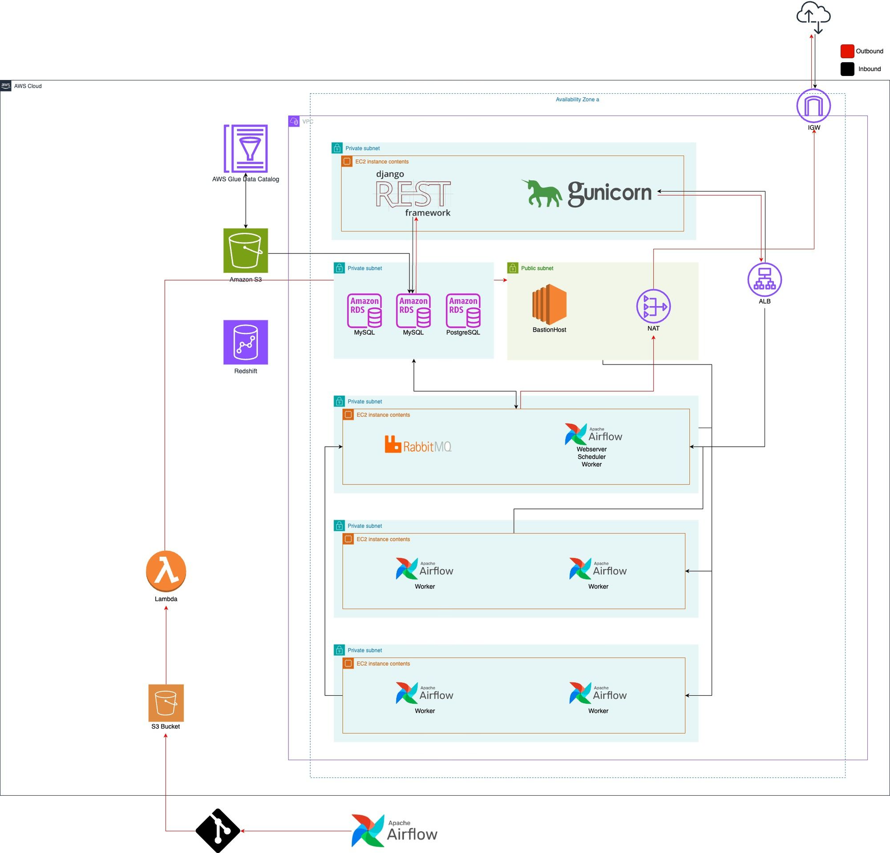
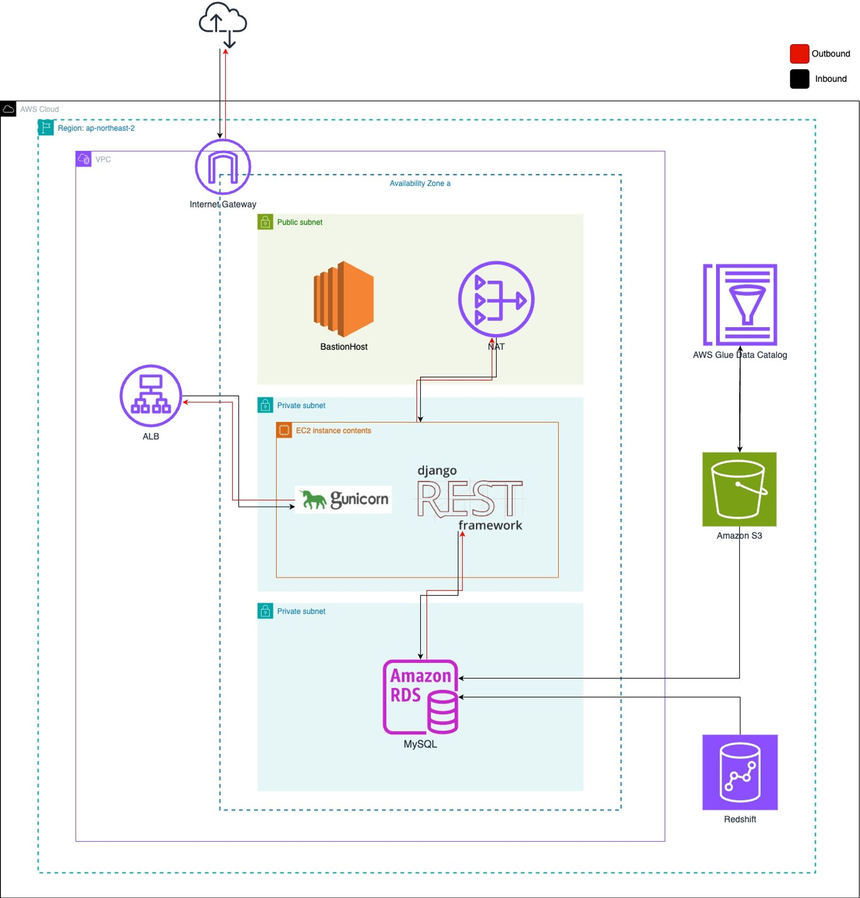
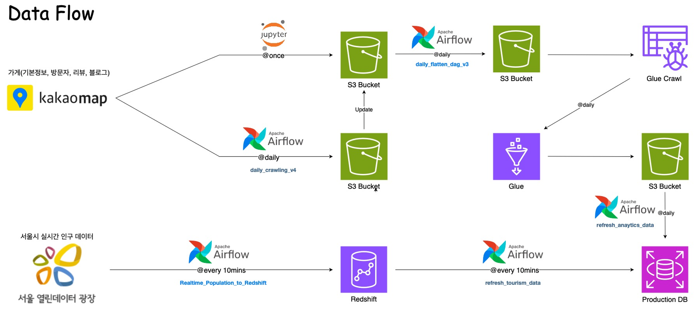
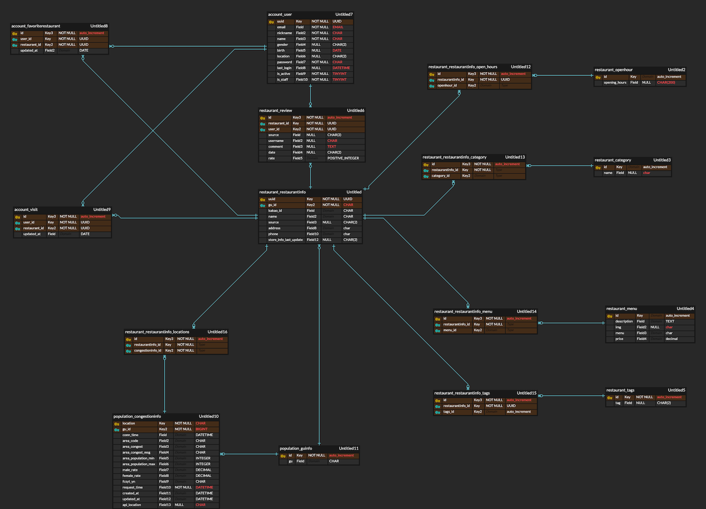
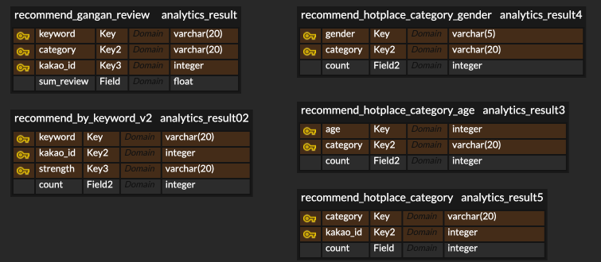
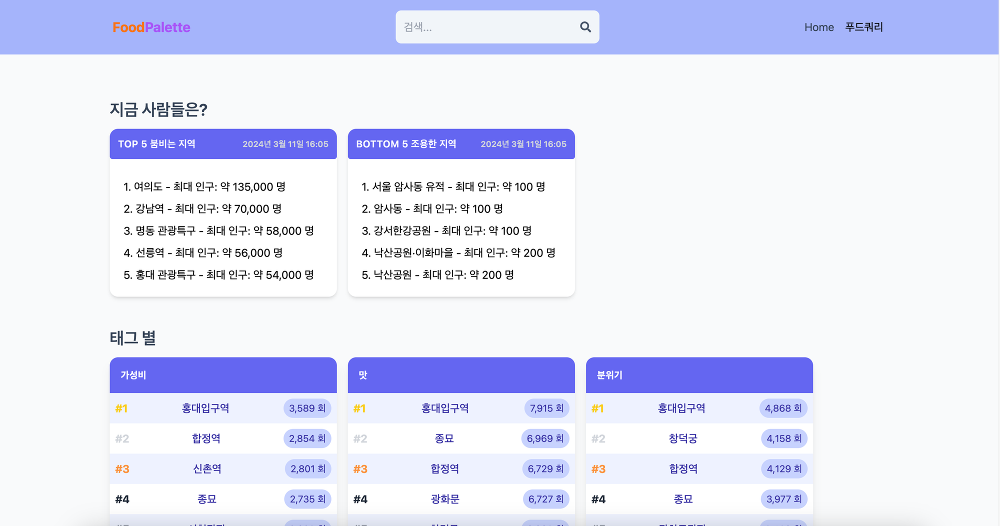
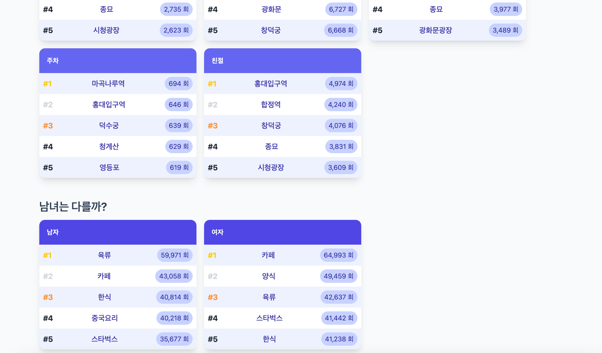
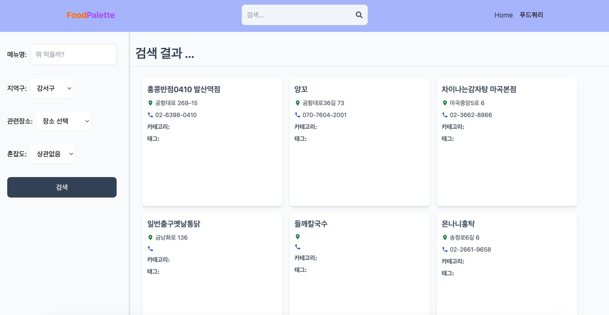
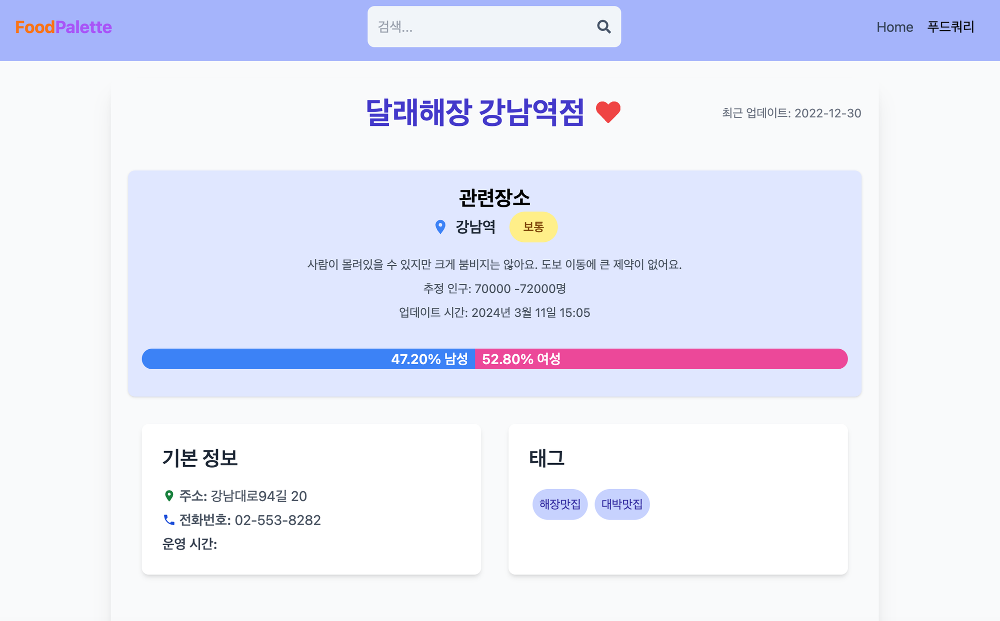

# FoodPalette

## 1. 프로젝트 주제

위치와 리뷰를 기반으로 한 서울시 맛집 추천 서비스 **Foodpalette**

 

## 2. 주제 선정 이유

- **주제 선정 시 고려 사항 1**: **데이터의 주기적인 업데이트**
    
    데이터 선정에 있어서 비중있게 고려한 사항은 **최소한 하루 주기로 변경되는 데이터를 활용할 수 있는지**였다. 식당 데이터의 경우, 가게 관련 정보는 업데이트 주기가 빠르지 않았으나 방문자와 리뷰 데이터가 거의 실시간으로 업데이트되기 때문에 **맛집의 최신 트렌드를 제공하는 등 이를 활용한 다양한 분석이 가능**하였다.
    
- **주제 선정 시 고려 사항 2**: **데이터의 충분한 규모**
    
    추가로 고려한 사항은 프로젝트에서 활용되는 **데이터가 충분한 규모와 다양성을 갖는지**였다.
    
    가게 데이터는 매일 변경되는 트렌드와 다양한 식당 정보를 담고 있고, 식당의 위치, 메뉴, 리뷰 등 데이터가 풍부하게 제공되어 대용량 데이터 처리에 알맞은 데이터 파이프라인을 다양하게 고민해볼 수 있었다.
    
    - 실제로 가게별 메뉴 데이터만 87GiB 이상, 15억개의 레코드가 쌓이기도 하였다.

 

## 3. 활용 기술 및 프레임워크

| 분류 | 기술 |
| --- | --- |
| 언어 | Python, SQL |
| 백엔드 | Django Rest Framework |
| 프론트엔드 | React |
| 스케줄링 | Apache Airflow |
| 클라우드 서비스 | AWS EC2, S3, Glue, Redshift, Lambda, RDS, GCP VM |
| 협업도구 | Slack, Github, Notion, Gathertown |

 

## 4. 전체 아키텍처

### 백엔드 아키텍처

### 데이터 파이프라인

 

**[가게 관련 정보]**

① 하루 주기로 카카오맵에서 가게의 기본 정보, 방문자 리뷰, 블로그 리뷰 등과 같은 가게 관련 정보를 크롤링하여 S3 버킷에 저장한다.(daily_crawling_v4)

② 그 후, 매일 주기로 S3 버킷에 저장된 데이터를 flatten화하는 작업을 실행한다.(daily_flatten_dag_v3) 이렇게 flatten화된 데이터는 Glue 크롤러를 통해 S3 데이터를 Glue로 불러온 후, 데이터 분석을 진행한다.

③ 분석된 데이터는 다시 S3에 저장되고, 마지막으로 프로덕션 데이터베이스로 분석된 데이터를 주기적으로 불러온다.(refresh_analytics_data)

**[실시간 인구 데이터]**

① 서울시 실시간 인구 데이터를 10분 주기로 불러와 Redshift에 적재한다. (Realtime_Population_to_Redshift)

② 인구 데이터의 지역명`location`과 연결 시간`conn_time` 열을 기준으로 지역별 가장 최신의 데이터를 추출하여 10분 주기로 프로덕션 데이터베이스로 `Bulk Update` 형식으로 전달한다.

## 5. ERD

### Backend

### Analytics

## 6. 웹 화면

 

